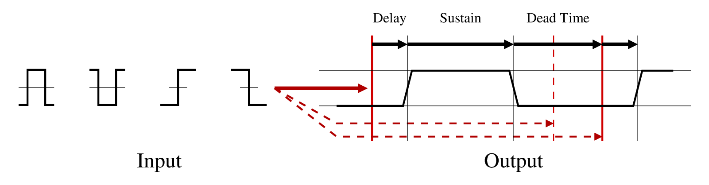

# TTL Tools Library

## Overview

This library provides implementations of several structures and signal
processing operations that are useful for TTL event processing. These were
originally part of the "TTL Conditional Trigger" plugin, but have been
packaged as a library for reuse in other plugins.

Elements offered are:
* A circular buffer template class.
* A set of objects for making TTL event FIFOs and producing TTL outputs
in response to "triggers" seen on TTL inputs.

## Circular Buffer Template

This is a light-weight circular buffer class with a statically allocated
buffer. This is useful for situations where:
* Fast, light-weight processing is critical (no calls to the heap manager for
dynamic allocation, no locking).
* Copy-by-value capability is desired.

This has the following drawbacks:
* Static allocation means that you need to know the buffer size at compile
time, are limited to that size, and are forced to allocate the full size for
all buffers whether they need it or not.
* No locking means that this buffer implementation is not MT-safe.

If you need MT-safe buffering, use one of JUCE's FIFO classes instead of
this.

## TTL Trigger Processing Classes

The following classes are provided for trigger processing:
* `LogicFIFO` - This encapsulates a FIFO buffer for TTL events. The internal
implementation uses a fixed-sized circular buffer. This is used as a base
class for more complex logic-processing classes.
* `LogicMerger` - This is given pointers to several input FIFOs and polls
them for pending events, providing the logical-AND or logical-OR of its
inputs. This encapsulates logic for merging multiple sorted event lists.
Polling also means we don't need input buffers (we use the upstream output
buffers instead).
* `ConditionProcessor` - This looks at an input TTL signal for trigger
events and asserts an output when a trigger event is seen. The input and
output configurations are flexible (encapsulated by the `ConditionConfig`
class).

A diagram illustrating some of the configurable trigger/output elements is
shown below:



## (From Open Ephys's documentation): Providing libraries for Windows

Since Windows does not have standardized paths for libraries, as Linux and macOS do, it is sometimes useful to pack the appropriate Windows version of the required libraries alongside the library files.
To do so, a *libs* directory has to be created **at the top level** of the repository, alongside this README file, and files from all required libraries placed there. The required folder structure is:
```
    libs
    ├─ include           #library headers
    ├─ lib
        ├─ x64           #64-bit compile-time (.lib) files
        └─ x86           #32-bit compile time (.lib) files, if needed
    └─ bin
        ├─ x64           #64-bit runtime (.dll) files
        └─ x86           #32-bit runtime (.dll) files, if needed
```
DLLs in the bin directories will be copied to the open-ephys GUI *shared* folder when installing.

_(This is the end of the file.)_
